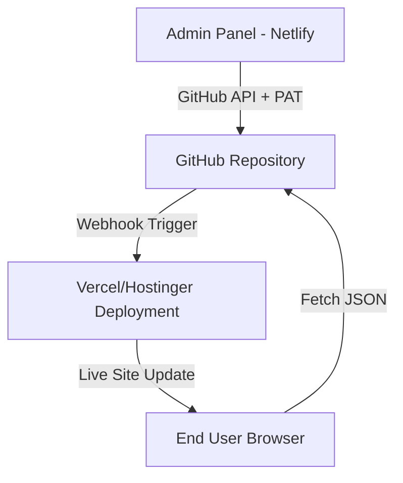

# Sahyadri Science Academy — Project Documentation

> **Last Updated:** 09 May 2026 (UI Modernization Phase 2 — Results Page)  
> **Status:** Static Frontend + Dynamic JSON Content (Git-Based Architecture)  
> **Branding:** Sahyadri Science Academy — WE MAKE CHAMPIONS  
> **Hosting:** Localhost:3000 (Development via `npx serve`) | GitHub Repo → Vercel / Hostinger (Production)

---

## Table of Contents

1. [Current Project State](#1-current-project-state)
2. [Architecture Flow](#2-architecture-flow)
3. [JSON Data Layer (The "Database")](#3-json-data-layer-the-database)
4. [Current File Structure](#4-current-file-structure)
5. [Page-by-Page Breakdown](#5-page-by-page-breakdown)
6. [Design System](#6-design-system)
7. [Admin Panel (GitHub API Method)](#7-admin-panel-github-api-method)
8. [Step-by-Step Processes (How-To)](#8-step-by-step-processes-how-to)
9. [Bug Fixes & Audit Log](#9-bug-fixes--audit-log)

---

## 1. Current Project State

The Sahyadri Science Academy website is a **high-performance static frontend** (HTML/CSS) powered by **vanilla JS dynamic rendering**. 
- **Frontend:** Vanilla HTML5 and CSS3 (Standardized in `index.css`).
- **Logic:** Vanilla JS fetches `data/*.json` files to render content dynamically across all major sections (News, Results, Ticker, Courses, Faculty).
- **Data Source:** Git-based JSON files, acting as a lightweight, serverless database.
- **Admin Control:** A dedicated Admin Panel (hosted on Netlify) allows non-technical staff to update the entire website by committing JSON changes directly to GitHub via the REST API.

---

## 2. Architecture Flow



1. **Update:** Admin makes changes in the panel.
2. **Commit:** Panel uses GitHub Personal Access Token (PAT) to push updated JSON/Images to the repo.
3. **Deploy:** Hosting provider (Vercel/Hostinger) auto-deploys the new build.
4. **Render:** User's browser fetches the latest JSON and renders the UI dynamically.

---

## 3. JSON Data Layer (The "Database")

All frequently updated data lives in `data/` as JSON.

### 1. `data/updates.json` (News & Announcements)
- **Used by:** `news.html`
- **Fields:** `title`, `date`, `description`, `tag`, `tagType`, `imageUrl`, `link`.
- **Behavior:** Sorted newest-to-oldest. The latest entry becomes the "Hero" announcement. Pagination loads 6 entries at a time.

### 2. `data/results.json` (Achievers)
- **Used by:** `results.html`
- **Fields:** `name`, `exam`, `category`, `badge`, `achievement`, `imageUrl`.
- **Behavior:** Includes a `starAchiever` object for the hero section. Results grid is filterable by `category` (JEE, NEET, MHT-CET, Boards).

### 3. `data/courses.json` (Programs & Courses)
- **Used by:** `course.html`, `index.html`
- **Fields:** `id`, `branch`, `class` (c1-c4), `title`, `script`, `description`, `subjects[]`, `badge`, `image`, `popular`.
- **Behavior:** Renders program cards dynamically for both **Uruli Kanchan** and **Shewalewadi** branches. Supports "Most Popular" ribbons and alternating layouts (`card-reverse`).

### 4. `data/faculty.json` (Expert Team)
- **Used by:** `founder.html`, `about.html`
- **Fields:** `name`, `role`, `description`, `imageUrl`, `emoji`.
- **Behavior:** Renders faculty cards. If `imageUrl` is missing, it falls back to a themed `emoji` placeholder.

### 5. `data/ticker.json` (Dynamic Ticker)
- **Used by:** All pages via `main.js`
- **Fields:** Array of strings.
- **Behavior:** Scrolling announcements at the top of every page.

---

## 4. Current File Structure

```
Sahyadri_Classes_Platform/
│
├── index.html              ← Homepage (Hero, Stats, Dynamic Programs CTA)
├── founder.html            ← Founder profiles & Dynamic Faculty Grid
├── news.html               ← News & Announcements (Dynamic News Grid)
├── results.html            ← Results / Achievers (Filtered Dynamic Grid — REDESIGNED)
├── about.html              ← About Us, Why Choose Us, Faculty Highlights
├── contact.html            ← Contact / Location / Lead Form
├── course.html             ← Foundation Course Page (Dynamic Branch Programs)
│
├── index.css               ← Main design system (Global styles & tokens)
├── results.css             ← Results-specific layout (Hero, Stats, Topper Spotlight)
│
├── data/
│   ├── updates.json        ← News database
│   ├── results.json        ← Results & Achievers database
│   ├── courses.json        ← Branch-wise programs database
│   ├── faculty.json        ← Faculty/Teacher database
│   └── ticker.json         ← Dynamic ticker announcements
│
├── js/
│   ├── main.js             ← Global UI (Nav, Ticker, Animations, Mobile menu)
│   ├── render-updates.js   ← Logic for news.html
│   ├── render-courses.js   ← Logic for course.html and index.html
│   └── results.js          ← Logic, count-up animation, and filtering for results.html
│
├── assets/
│   ├── sahyadri-logo.png   ← Official logo
│   └── uploads/            ← Storage for dynamic images (Results, News, Faculty)
│
└── PROJECT_DOCS.md         ← THIS FILE
```

---

## 4a. Deployment Guide (New Machine)

To run this project on a different laptop:

1. **Install Node.js**: Download and install from [nodejs.org](https://nodejs.org/).
2. **Copy Project**: Copy the entire `Sahyadri_Classes_Platform` folder to the new laptop.
3. **Open Terminal**: Navigate to the folder in your terminal/command prompt.
4. **Run Local Server**:
   ```bash
   npx serve .
   ```
5. **Access Website**: Open your browser and go to `http://localhost:3000`.

*Note: Since the project uses fetch calls to JSON data, it must be run on a local server to avoid CORS issues. Simply opening index.html in a browser will not load dynamic content.*

---

## 5. Page-by-Page Breakdown

### `index.html` (Homepage)
- **Premium Hero Redesign**: Modern SaaS-style blended layout with gradient overlays.
- **Floating Stats**: Glassmorphism cards for Enrolled Students (5500+) and Success Rate (99%).
- **Dynamic Programs**: rendered via `render-courses.js`.

### `course.html` (Programs Page)
- **Branch-specific Navigation**: Uruli Kanchan vs. Shewalewadi.
- **Improved UX**: "Explore Courses ↓" scroll buttons for instant access to branch-specific programs.
- **Dynamic rendering**: Loads all 4 programs per branch (Foundation, Secondary, HSC, Competitive).

### `founder.html` (Leadership)
- Profile of Prof. Pratap Mane (Founding Director).
- Profile of Prof. Pankaj Mane (Managing Director).
- **Dynamic Faculty Grid:** Loads all subject experts from `faculty.json`.

---

## 6. Design System

| Element | Value |
| :--- | :--- |
| **Primary Navy** | `#1E3A8A` (Deep Navy) |
| **Hero Background** | `#0f2a5a` (SaaS Dark Navy) |
| **Accent Orange** | `#FF7A00` (Brand Orange) |
| **Button Gradient** | `linear-gradient(135deg, #ff7a00, #ff9a3d)` |
| **Typography** | Inter (UI) / Poppins (Headings) |
| **Effects** | Glassmorphism, SaaS Blended Hero, Shadow-Soft |

---

## 7. Admin Panel (GitHub API Method)

### Location
Standalone Repository: `Sahyadri_Admin_Panel` (Hosted on Netlify).

---

## 8. Step-by-Step Processes (How-To)

### Adding a New Student Result
1. Open Admin Panel -> **Results** tab.
2. Click **Add New Result**.
3. Upload student photo (auto-saved to `assets/uploads/`).
4. Enter Name, Category (JEE/NEET), and Achievement (e.g., "99.8%").
5. Click **Push to GitHub**. Website updates in ~60 seconds.

### Updating the Scrolling Ticker
1. Open Admin Panel -> **Ticker** tab.
2. Edit the list of announcement strings.
3. Click **Save & Push**. All pages on the website will show the new ticker immediately after deploy.

---

## 9. Bug Fixes & Audit Log

### 18 - 23 April 2026 — Optimization Phase
- Eliminated dead Supabase libraries (Saved 185KB).
- Migrated 1000+ lines of inline CSS to `index.css`.
- Standardized navigation and footer across all 7 pages.
- Added mobile menu functionality to all pages.

### 01 May 2026 — Faculty Image Fix
- **Issue:** Faculty photos were cropped/zoomed incorrectly.
- **Fix:** Changed `object-fit` to `contain` and added padding/background in `founder.html` and `about.html` cards.

### 02 May 2026 — Dynamic Course Rendering
- **Feature:** Implemented `render-courses.js` to eliminate hardcoded HTML in `course.html`.
- **Fix:** Resolved JSON fetch errors caused by path mismatches in subdirectories.

### 03 May 2026 — Documentation Overhaul
- **Update:** Complete rewrite of `PROJECT_DOCS.md` to reflect the new dynamic architecture and provide clear step-by-step guides for site management.

### 08 May 2026 — UI Modernization & UX Enhancement
- **Hero Section Redesign (`index.html`)**: 
  - Transformed split layout to a premium **SaaS-style blended layout**.
  - Added **Gradient Overlay** (`90deg`) for seamless image-text blending.
  - Implemented **Floating Stat Cards** with glassmorphism, SVG icons, and `floatUp` animations.
  - Updated typography with `64px` headings and high-contrast orange highlights.
- **Navigation Improvement (`course.html`)**:
  - Replaced "Book Free Demo" buttons with **"Explore Courses ↓"** scroll links in branch cards.
  - Implemented smooth scrolling to `#uruli-programs` and `#Shewalewadi-programs`.
- **Hosting**: Project hosted on local port 3000 for development preview.

### 09 May 2026 — Results Page Redesign & Deployment Audit
- **Results Hero Redesign**: 
  - Implemented **Stripe-style 2-column grid** for better balance and content density.
  - Upgraded **Stats Cards** with glassmorphism, circular icons, and count-up animations.
  - Fixed **Student Image Section** with a professional full-bleed layout and high-contrast blending.
  - Repositioned **Bottom Stats Strip** to avoid overlap and enhanced it with a dashboard-style UI.
- **JS Audit & Verification**:
  - Verified `results.js`: Successfully implementing IntersectionObserver for count-up metrics.
  - Verified `main.js`: Global animations, nav scroll, and dynamic ticker are working correctly.
  - Verified `render-courses.js`: Branch-wise programs rendering correctly for both Uruli and Shewalewadi.
- **Deployment Prep**: Updated `PROJECT_DOCS.md` with the latest structure and a step-by-step deployment guide for cross-machine migration.
- **Hosting**: Migrated local server command to `npx serve .` for better static file serving.
